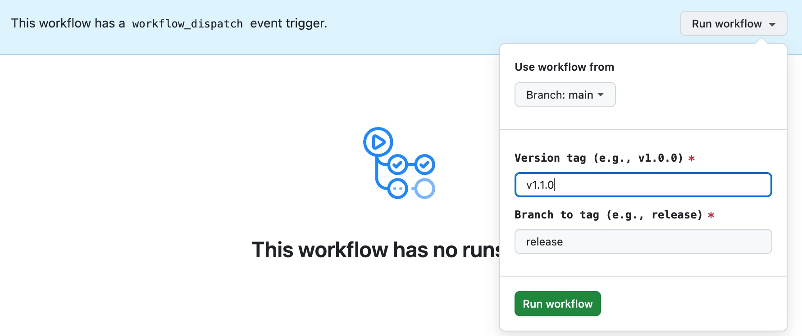

# HM Primary Category Block

Displays the primary category for a post in the WordPress block editor.

## Features

- Displays the primary category for a post
- Supports Yoast SEO primary category selection
- Server-side rendered for optimal performance

## Usage

The Primary Category block is automatically available after plugin activation. The block uses the `postId` context and is typically used within:

- Query Loop blocks
- Post Templates
- Single post layouts

### How it works

1. The block automatically detects the post ID from context
2. If Yoast SEO is active, it uses the primary category set by Yoast
3. For posts with multiple categories, it returns the top-level parent category
4. For single category posts, it returns that category

### Block Name

The block is registered as `hm/primary-category` and can be inserted programmatically or used in block patterns.

### Customization

The block outputs a link with the class `hentry__category` which can be styled via CSS:

```css
.hentry__category {
    /* Your custom styles */
}
```

## Installation

1. Clone this repository to your WordPress plugins directory
2. Run `npm install` to install dependencies
3. Run `npm run build` to build the block
4. Activate the plugin in WordPress

## Development

- `npm start` - Start development mode with hot reload
- `npm run build` - Build production files
- `npm run lint` - Run linters

## Requirements

- WordPress 6.0+
- PHP 8.2+
- Node.js 22+

## Release Process

Merges to `main` will automatically [build](https://github.com/humanmade/primary-category/actions/workflows/build-release-branch.yml) to the `release` branch. A project may be set up to track the `release` branch using [composer](http://getcomposer.org/) to pull in the latest built beta version.

Commits on the `release` branch may be tagged for installation via [packagist](https://packagist.org/packages/humanmade/primary-category) and marked as releases in GitHub for manual download using a [manually-dispatched "Tag and Release" GH Actions workflow](https://github.com/humanmade/primary-category/actions/workflows/tag-and-release.yml).

To tag a new release,

1. Review the unreleased features in the [Changelog](./CHANGELOG.md) and choose the target version number for the next release using [semantic versioning](https://semver.org/)
2. Checkout a `prepare-v#.#.#` branch. In that branch,
   - Add a new header into [CHANGELOG.md](./CHANGELOG.md) for any unreleased features
   - Bump the version number in the [hm-primary-category-block.php](./hm-primary-category-block.php) file's PHPDoc header
3. Open a pull request from your branch titled "Prepare release v#.#.#"
4. Review and merge your "Prepare release" pull request
5. Wait for the `release` branch to [update](https://github.com/humanmade/primary-category/actions/workflows/build-release-branch.yml) with the build that includes the new version number
6. On the ["Tag and Release" GH Action page](https://github.com/humanmade/primary-category/actions/workflows/tag-and-release.yml)],
   - Click the "Run workflow" button in the "workflow_dispatch" notification banner (see screenshot below)
   - Fill out the "Version tag" field with your target version number
      - This version must match the version in `hm-primary-category-block.php` and your newest Changelog section
      - Use the format `v#.#.#` for your version tag
   - Leave the "Branch to tag" field as `release` (we will add the tag on the release branch containing the latest built code)
   - Click "Run workflow"



Once the workflow completes, your new version should be [tagged](https://github.com/humanmade/primary-category/tags) and available in the list of [releases](https://github.com/humanmade/primary-category/releases)

## License

GPL-2.0-or-later
